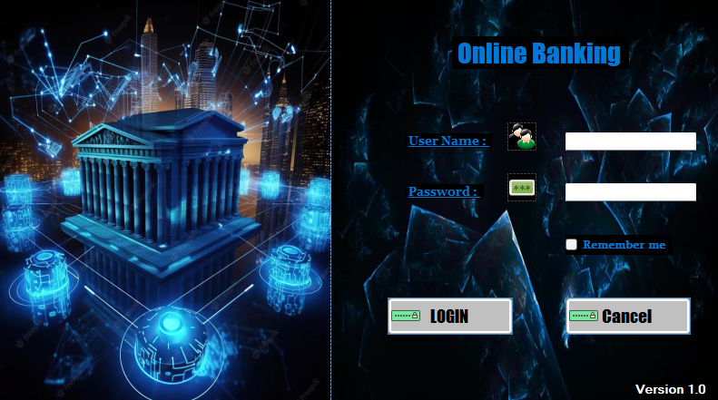
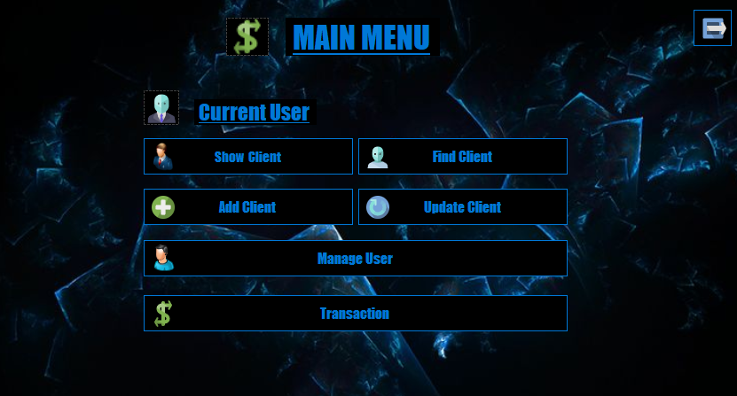
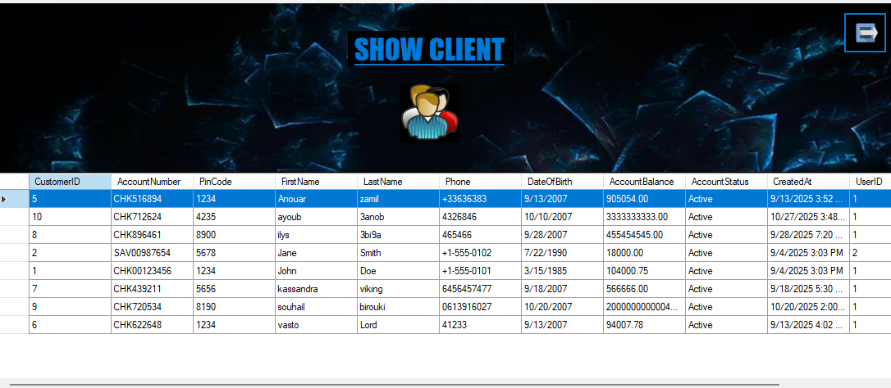
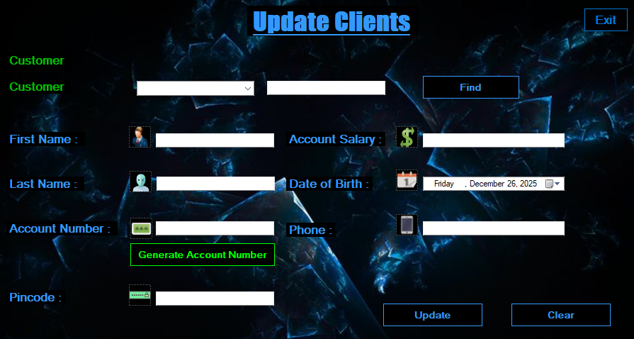
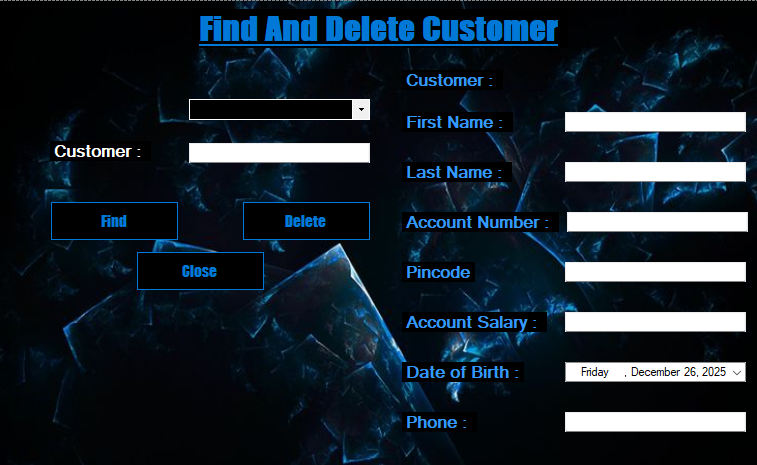
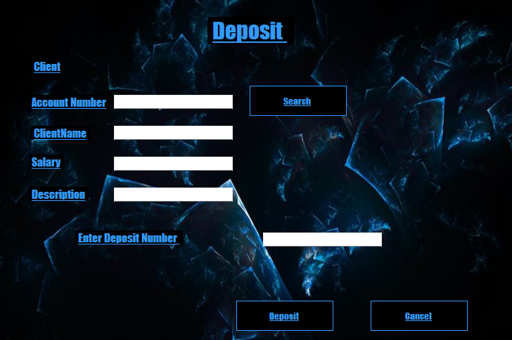
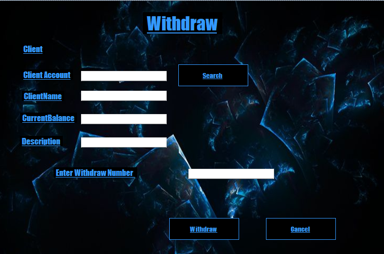
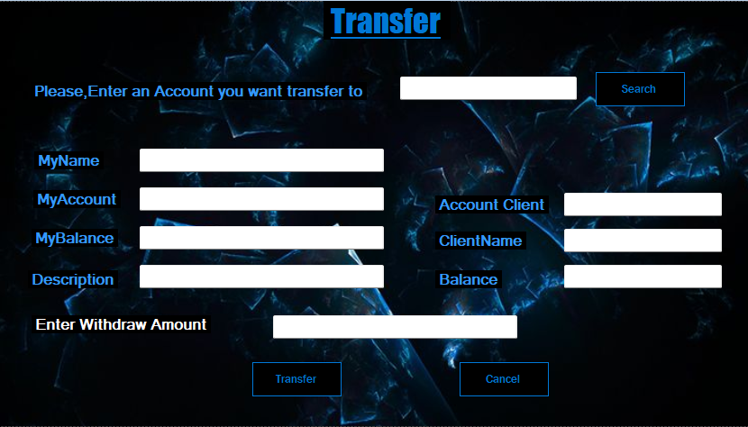
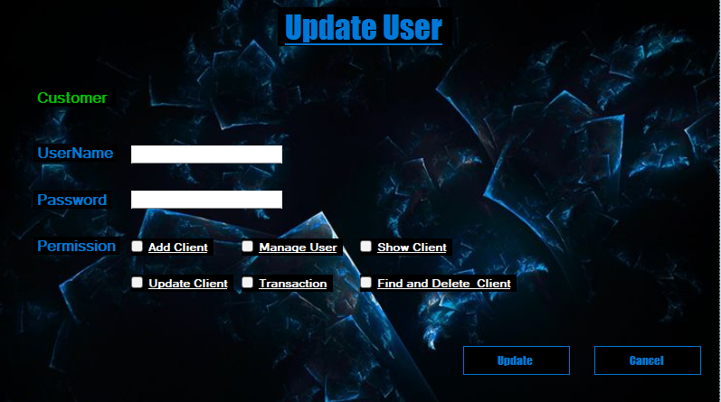
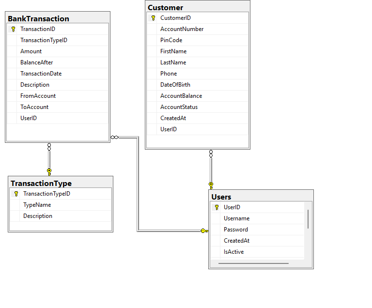

# 🏦 Bank Management System – C# Desktop Application

A **desktop Bank Management System** built using **C# and Windows Forms**, designed to simulate real-world banking operations with a clean architecture and structured business logic.

This project demonstrates strong foundations in **Object-Oriented Programming**, **database handling**, and **desktop application development**.

---

## 🚀 Features

- User authentication (Admin / User)
- Client management (Add, update, delete clients)
- Account creation and management
- Deposit & withdrawal operations
- Transaction tracking
- Secure data handling
- Clean and structured UI
- Layered architecture (Business / Data / UI)

---

## 🛠️ Technologies Used

- **C#**
- **.NET Framework**
- **Windows Forms (WinForms)**
- **SQL Server**
- **T-SQL**
- **Object-Oriented Programming (OOP)**

---

## 🧠 Architecture

The project follows a **clean multi-layered architecture**:

- **Presentation Layer** – Windows Forms (UI)
- **Business Layer** – Business logic & rules
- **Data Access Layer** – SQL & database operations

This separation improves:
- Maintainability
- Scalability
- Code readability

---

## 📸 Screenshots

### 🔐 Login

### 🏠 Main Menu

### 👤 Add Client

### 📋 Show Clients

### ✏️ Update Client

### 🔍 Find & Delete Client

### 💰 Deposit

### 💸 Withdraw

### 🔁 Transfer

### 📑 Transactions History

### 👮 User Management

### 🔐 Update User

### 🗄️ Database Structure

